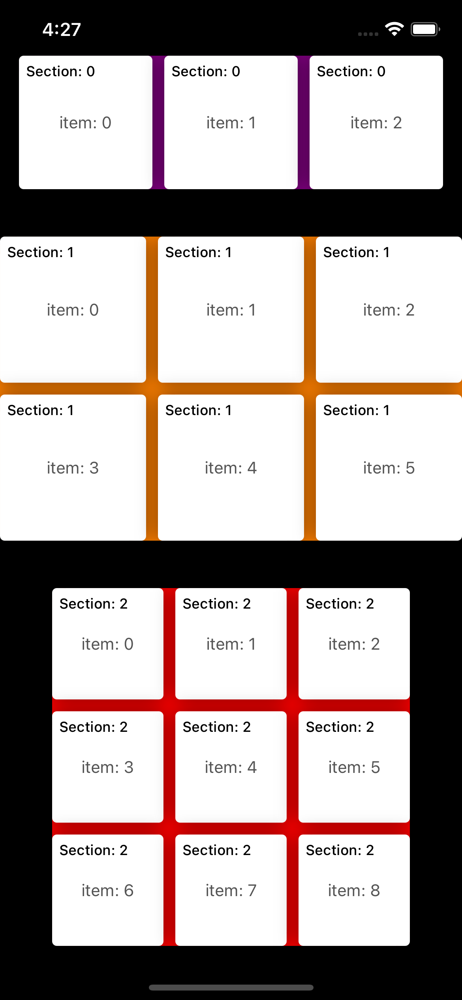

# InsetLayout

可自由配置 `UICollectionView` 的每个 `section` 的 `inset`, `item spacing`, `line spacing`~


#### Preview




代码示例 (完整示例可查看 Demo)：

```swift
// 返回 Item Size
extension ViewController: UICollectionViewDelegateFlowLayout {
    private func size(for contentWidth: CGFloat) -> CGSize {
        let w: CGFloat = (contentWidth / 3)
        return CGSize(width: w, height: w)
    }
    
    func collectionView(_ collectionView: UICollectionView, layout collectionViewLayout: UICollectionViewLayout, sizeForItemAt indexPath: IndexPath) -> CGSize {
        if indexPath.section == 0 {
            return size(for: UIScreen.main.bounds.width - 32 - 20)
        } else if indexPath.section == 1 {
            return size(for: UIScreen.main.bounds.width - 20)
        } else {
            return size(for: UIScreen.main.bounds.width - 88 - 20)
        }
    }
}
```


```swift
// 配置不同 section 的样式
extension ViewController: InsetLayoutDelegate {
    
    func inset(at section: Int) -> UIEdgeInsets {
        if section == 0 {
            return UIEdgeInsets(top: 10, left: 16, bottom: 10, right: 16)
        } else if section == 1 {
            return UIEdgeInsets(top: 30, left: 0, bottom: 10, right: 0)
        } else {
            return UIEdgeInsets(top: 30, left: 44, bottom: 10, right: 44)
        }
    }
    
    func lineSpacing(at section: Int) -> CGFloat {
        if section == 0 {
            return 10
        } else if section == 1 {
            return 10
        } else {
            return 10
        }
    }
    
    func interitemSpacing(at section: Int) -> CGFloat {
        if section == 0 {
            return 10
        } else if section == 1 {
            return 10
        } else {
            return 10
        }
    }
}
```

```swift
// section 的背景视图，这里返回类即可
extension ViewController: SectionDecorationDelegate {
    
    func decorationType(at section: Int) -> UICollectionReusableView.Type? {
        DemoDecorationView.self
    }
    
}
```


#### Install

```swift
.package(url: "https://github.com/iWECon/InsetLayout.git", .upToNextMajor(from: "1.0.0"))
```
